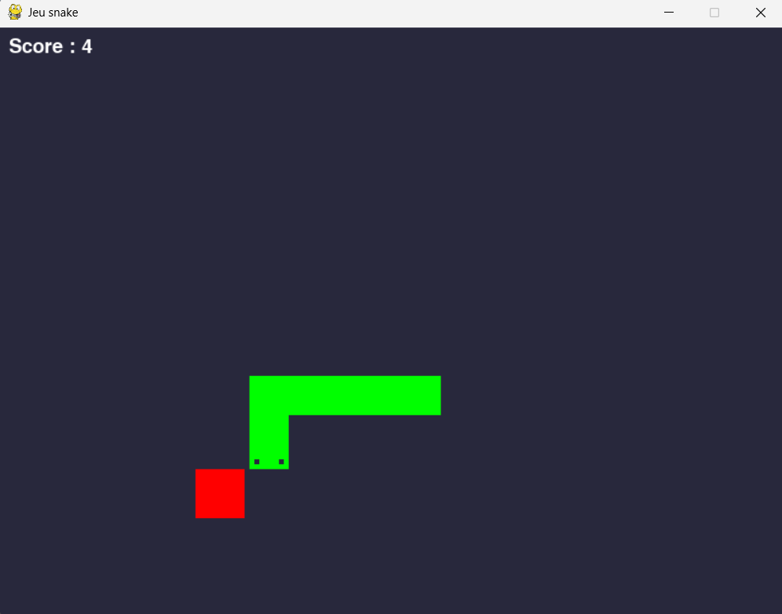

# 🐍 Snake Game


  
  

---

## 📝 Project Description 
This project is a **classic Snake game** built with Pygame.  
You can play manually, or let the snake move automatically with random actions.  

The game also provides detailed **distance calculations** to food and walls (in all 8 directions).  
These metrics are useful for **training AI agents** later on, such as [Snake AI - GA](https://github.com/Thibault-GAREL/AI_snake_genetic_version) and [Snake AI - DQL](https://github.com/Thibault-GAREL/AI_snake_DQN_version).  

---

## ⚙️ Features
  🎮 Playable Snake game with smooth movement  

  🍎 Food spawning and snake growth  

  🟩 Detailed snake rendering (head, body, tail with unique visuals)  

  📏 Functions to compute distances to **walls** and **food** in all directions (N, S, E, W, NE, NW, SE, SW)  

  🤖 Option to toggle **player mode** or **random agent mode**  

  🖼️ Optional checkerboard display for debugging  

---

## 🎮 Example Screenshots
Here’s what the Snake game looks like:



---

## ⚙️ How it works

  🕹️ Control the snake manually with the arrow keys (**UP, DOWN, LEFT, RIGHT**) or let the random agent play.  

  🍎 When the snake eats food, it grows by 1 segment and new food is generated.  

  💥 Collision with walls or itself ends the game.  

  📊 Extra functions calculate distances to walls and food, allowing the game to be used as an environment for AI.  

---

## 🗺️ Schema  
💡 The snake is represented as a list of `Snake` objects, while food is a simple `food` object.  
The environment provides **distance functions** that can be reused in AI or reinforcement learning projects.  

---

## 📂 Repository structure  
```bash
├── img/
│   └── example.png
│
├── snake.py
│
├── LICENSE
├── README.md
```

---

## 💻 Run it on Your PC  
Clone the repository and install dependencies:  
```bash
git clone https://github.com/Thibault-GAREL/snake_game.git
cd snake_game

python -m venv .venv # if you don't have a virtual environment
source .venv/bin/activate   # Linux / macOS
.venv\Scripts\activate      # Windows

pip install pygame

python main.py
```

---

## 📖 Inspiration / Sources  
😆 100% coded by myself, no external tutorials!
