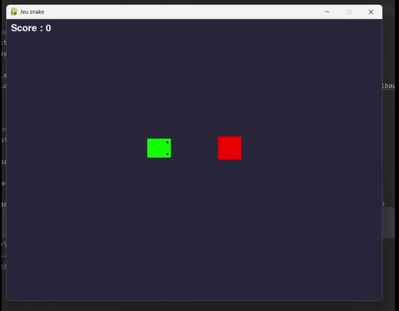

# 🐍 Snake Game


  
  

<p align="center">
  
</p>


---

## 📝 Project Description 
This project is a **classic Snake game** built with **Pygame** on an 800×600 grid with 50×50 cells.  
You can play manually, or switch to an **automatic random agent** mode via a simple flag.  

The game also exposes **16 distance functions** (walls + food, in all 8 directions) that serve as the observation space for **AI agents**.  
This codebase was used as the environment for multiple **Reinforcement Learning** projects:
[Snake AI - DT](https://github.com/Thibault-GAREL/AI_snake_decision_tree_version), [Snake AI - GA](https://github.com/Thibault-GAREL/AI_snake_genetic_version), [Snake AI - DQL](https://github.com/Thibault-GAREL/AI_snake_DQN_version) and [Snake AI - PPO](https://github.com/Thibault-GAREL/AI_snake_PPO_version).  

A complete **XAI (Explainable AI) report** was written across these projects, analyzing and explaining the decision-making of each agent. 📄

---

## ⚙️ Features
  🎮 Playable Snake game with smooth movement on a **16×12 grid** (800×600 px, 50×50 cells)  

  🍎 Food spawning and snake growth on every eat  

  🟩 Detailed snake rendering: **head** (with eyes), **body** (with corner joints), and **tail** — all direction-aware  

  📏 **8 wall-distance functions** (N, S, E, W, NE, NW, SE, SW) — also detect body collisions on the same axis  

  🍏 **8 food-distance functions** (N, S, E, W, NE, NW, SE, SW) — return 0 if food is not on that axis  

  🤖 `player` flag to switch between **human control** (arrow keys) and **random agent** mode  

  👁️ `show` flag to toggle **rendering on/off** — useful for headless AI training  

  🛠️ `info` flag to **print all 16 distances** to the console each step  

  ⏱️ `stop_iteration` to cap the number of game steps (default: **100**)  

  🖼️ Optional `draw_checkerboard()` for grid debugging  

---

## ⚙️ How it works

  🕹️ In **player mode**, control the snake with arrow keys (UP, DOWN, LEFT, RIGHT). A direction reversal is blocked.  

  🤖 In **random agent mode**, a random action is sampled each frame from `{0, 1, 2, 3}` (UP, RIGHT, DOWN, LEFT).  

  🍎 When the head reaches the food tile, the snake grows by 1 segment and a new food is spawned on a free cell.  

  💥 The game ends on wall collision, self-collision, or when `stop_iteration` is reached.  

  📊 Each frame, the 16 distance functions can be called to build an observation vector for an AI agent.  

  👁️ Set `show = False` to run the game **without a window** — useful when calling `snake.py` from an external training loop.  

---

## 🗺️ Schema

The environment is built around two **dataclasses** and one **manager class**:

```text
Snake(x, y)          → one segment of the snake
food(x, y)           → the current food tile
Manager_snake        → holds the list of segments, direction, and move/draw logic
```

Distance functions are split into two families, each covering **8 directions**:

```text
distance_wall_*      → distance from head to wall (or body on same axis)  (N, S, E, W, NE, NW, SE, SW)
distance_food_*      → distance from head to food if aligned on that axis  (N, S, E, W, NE, NW, SE, SW)
```

These 16 values form the **observation vector** used by all the AI versions of this project.

---

## 📂 Repository structure  
```bash
├── img/
│   ├── Snake-game.gif        # Hero GIF for the README
│   └── example.png
│
├── snake.py                  # Game engine + distance functions + game loop
├── main.py                   # Entry point (imports and runs snake.py)
│
├── LICENSE
├── README.md
```

---

## 💻 Run it on Your PC  
Clone the repository and install dependencies:  
```bash
git clone https://github.com/Thibault-GAREL/snake_game.git
cd snake_game

python -m venv .venv # if you don't have a virtual environment
source .venv/bin/activate   # Linux / macOS
.venv\Scripts\activate      # Windows

pip install pygame

python main.py
```

To switch modes, edit the flags at the top of `snake.py`:

```python
show   = True   # False → headless (no window)
player = True   # False → random agent
info   = False  # True  → print distances to console each step
```

---

## 📖 Inspiration / Sources  
I code it without any help 😆 !

Code created by me 😎, Thibault GAREL - [Github](https://github.com/Thibault-GAREL)
